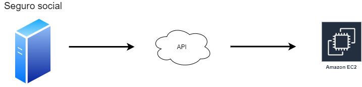
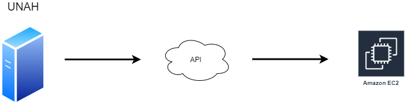

```{r include=FALSE, results="hide"}

library(dplyr)
library(tidytext)
library(stringr)
library(reshape2)
library(ggplot2)
library(corrplot)
library(factoextra)


setwd("C:/Users/cesar/Programming/Capitulo 4 encuesta/Encuesta Seminario.csv")
survey <- read.csv("Encuesta Seminario.csv",header = T, sep = ",", encoding = "UTF-8")

```
# Analisis empleabilidad estudiantes egresados de ingeniera en sistemas

## Introducción

 Se realizó una encuesta a los estudiantes egresados de la carrera de ingenieria en sistemas de la Universidad Autonoma de Honduras para lograr investigar el porcentaje de desempleo en los estudiantes egresados. Dentro de nuestros compañeros no es extraño escuchar que más de alguno de los companeros graduados sigue sin enconrar trabajo despues de haberse graduado. Nosotros mediante la encuesta queremos ver que hace un estudiante empleable y que no. Estos dato no solo ayudaran al estudiante si no que tambien serviran a la administracion de la carrera en ingeniera en sistemas para ver donde puede mejorar y ayudar a sus estudiantes.
 


# Observando las variables capturadas


```{r include=FALSE, results="hide"}

stop_words_spanish <- read.delim("stop_words_spanish.txt", header = TRUE, sep = "\n", encoding = "UTF-8")

my.names <- names(survey)

columnas_a_tratar <- my.names[!(names(survey) %in% c("portafolio"))]
df <- data.frame(columna.name = columnas_a_tratar)
df$columna.name

write.csv(df,"column_names.csv", row.names=FALSE)

column_names <- read.csv("column_names_clean.csv",header = T, sep = ",")

column_names$translation
names(survey)

names(survey) <- column_names$translation
```
## Variables Capturadas


### Resumen de las variables
```{r}
str(survey)

```

Las variables que capturamos demuestran:

- Rendimiento academico

- Competencias

- vida universitaria

- post graduacion

- practica profesional

- hard skill

- soft skills

Para ver mejor las variables podemos ver un resumen :


```{r}
summary(survey)

```

# Tratamiento Columnas

Como podemos ver nuestro data set se encuentra con valores nulos, valores vacion, outliers con valores muy grandes. Y tambien podriamos mejorar la presentacion de algunas de las variables como lugar de procedencia por ejemplo.

### Limpiando columna trabajo_ingeniero_sistemas

trabajo_ingeniero_sistemas se dejo como pregunta opcional y recibimos valores vacios

```{r }
unique(survey$trabajo_ingeniero_sistemas) %in% c("No", "Sí", "")


si_no <- c()

for (myname in names(survey)){

    
    validations <-sum(unique(survey[,myname]) %in% c("No", "Sí", ""))
    if(validations == 3){
    si_no <- c(si_no,myname)
    }
}

table(survey[, si_no[1] ])

```
Vemos que tiene 9 valores vacios. Si bien se acostumbra poner los datos vacios en la media, en este caso no podriamos hacer eso. Crearemos una nueva categoria para estos valores como " actualmente no labora"

```{r}

survey$trabajo_ingeniero_sistemas <- as.character(survey$trabajo_ingeniero_sistemas)


for (col in si_no){
  survey[ survey[,col] == "", col] <- "actualmente no labora"
}

table(survey$trabajo_ingeniero_sistemas) 

```

## Limpiando valores nulos


```{r include=FALSE, results="hide"}

na.summay <- c()

for( myname in names(survey)){
  print(myname)
  
  s <- as.data.frame(prop.table(table(is.na(survey[,myname]))))
  operacion <- s %>% filter(Var1 == TRUE) %>% select(Freq)
  
  df_temp <- data.frame( 
    column.name=c(myname),  
    na.percentage = ifelse( length(operacion$Freq) == 0, 0, operacion$Freq[1] )
  )
  
  na.summay <- rbind(na.summay,df_temp)

  
}
```


```{r}
na.summay %>% arrange(-na.percentage) %>% filter(na.percentage > 0)

```

Miramos que tenemos dos columnas con valores nulos anio_graduacion y mes_graduacion


```{r}
survey$anio_graduacion <- as.integer(survey$anio_graduacion)
x <- survey %>% filter(!is.na(anio_graduacion))
media <- median(x$anio_graduacion)
survey[is.na(survey$anio_graduacion),"anio_graduacion"] <- media
survey$anio_graduacion <- as.factor(survey$anio_graduacion)

table(survey$anio_graduacion)
```
Tambien vemos que hay un outlier. Siendo la pregunta ¿Cuál fue tu año de graduacion? y ya que estamos en el 2020 podemos agregar este outlier dentro de la media

```{r}
survey$anio_graduacion <- as.numeric(paste(survey$anio_graduacion))
survey$anio_graduacion[[55]] <- median(survey$anio_graduacion)
table(survey$anio_graduacion)

```


## Valores nulos mes_graduacion
se encontro un na en mes_graduacion, se añadirá a la media

```{r}
survey$mes_graduacion <- as.integer(survey$mes_graduacion)
x <- survey %>% filter(!is.na(mes_graduacion))

media <- median(x$mes_graduacion)
survey[is.na(survey$mes_graduacion),"mes_graduacion"] <- media
survey$mes_graduacion <- as.factor(survey$mes_graduacion)

table(survey$mes_graduacion)
```
## Valores nulos promedio_graduacion
```{r}
table(survey$promedio_graduacion)
```

Vemos que promedio graduacion tiene un outlier que podemos agregarlo a la media. 

```{r}
media <- median(survey$promedio_graduacion)
survey[survey$promedio_graduacion > 101, "promedio_graduacion"] <- media
table(survey$promedio_graduacion)
#survey$promedio_graduacion[[21]] <- media
```

## Limpiando nombres de procedencia

Al ser un campo abierto tuvimos problemas en las respuestas

## Limpiando Tegucigalpa
 

```{r}


tegus <- c("Tegucigalpa","Tegucigalpa ","Tegucigalpa, Francisco Morazan","Tegucigalpa M. D. C", "Tegucigalpa M.D.C.", "FM", "Francisco Morazan")


unique(survey$procedencia) %in% tegus

tegus_repetidos <- c()

for (myname in names(survey)){

    
    validations <-sum(unique(survey[,myname]) %in% tegus)
    if(validations == 7){
    tegus_repetidos <- c(tegus_repetidos,myname)
    }
}


survey$procedencia <- as.character(survey$procedencia)

for (col in tegus_repetidos ){
  survey[ survey[,col] %in% tegus, col] <- "Tegucigalpa"
}

survey$procedencia <- as.factor(survey$procedencia)


```

### Limpiando El Paraiso

```{r}

paraiso <- c("El Paraíso","El paraíso, El Paraíso")


unique(survey$procedencia) %in% paraiso


paraiso_repetidos <- c()

for (myname in names(survey)){

    
    validations <-sum(unique(survey[,myname]) %in% paraiso)
    if(validations == 2){
    paraiso_repetidos <- c(paraiso_repetidos,myname)
    }
}


survey$procedencia <- as.character(survey$procedencia)

for (col in paraiso_repetidos ){
  survey[ survey[,col] %in% paraiso, col] <- "El Paraiso"
}

survey$procedencia <- as.factor(survey$procedencia)


```

### Limpiando La Esperanza
```{r}

la_esperanza <- c("La Esperanza, Intibucá")


unique(survey$procedencia) %in% la_esperanza


la_esperanza_repetidos <- c()

for (myname in names(survey)){

    
    validations <-sum(unique(survey[,myname]) %in% la_esperanza)
    if(validations == 1){
    la_esperanza_repetidos <- c(la_esperanza_repetidos,myname)
    }
}


survey$procedencia <- as.character(survey$procedencia)

for (col in la_esperanza_repetidos ){
  survey[ survey[,col] %in% la_esperanza, col] <- "La Esperanza"
}

```


# Preguntas abiertas

Tokenizando respuestas a las preguntas abiertas de las herramientas que aprendio en la u y las herramientas que aprendio solo debido al formato de estas preguntas vemos que estan separadas por coma y la mayoria solamente tienen los nombres de las tecnologias, decidimos que tokenizar es la mejor idea

```{r}

mock_data <- survey$tecnologias_unah
copia_survey <- survey

mock_data <- as.character(mock_data)
mock_data <- tolower(mock_data)
mock_data <- as.vector(mock_data)
mock_data <- str_replace_all(mock_data, fixed(", "), ",")
mock_data <- str_replace_all(mock_data, fixed(" ,"), ",")
mock_data <- str_replace_all(mock_data, fixed("."), "")
mock_data <- str_replace_all(mock_data, fixed("\U0001f923"), "")
mock_data <- str_squish(mock_data)

mock_data <- strsplit(mock_data, ",")

survey$tecnologias_unah <- mock_data

head(survey$tecnologias_unah,5)


```

### Tokenizando tecnologias aprendidas fuera de la unah


```{r}


fuera_unah <- survey$tecnologias_autodidacta
copia_survey <- survey

fuera_unah <- as.character(fuera_unah)
fuera_unah <- tolower(fuera_unah)
fuera_unah <- as.vector(fuera_unah)
fuera_unah <- str_replace_all(fuera_unah, fixed(", "), ",")
fuera_unah <- str_replace_all(fuera_unah, fixed(" ,"), ",")
fuera_unah <- str_replace_all(fuera_unah, fixed("."), "")
fuera_unah <- str_squish(fuera_unah)

fuera_unah <-strsplit(fuera_unah, ",")

survey$tecnologias_autodidacta <- fuera_unah

head(survey$tecnologias_autodidacta,5)

```

### Limpieza de herramientas en la industria
```{r}


data_industria <- survey$tecnologias_mercado_laboral
copia_survey <- survey
stop_words <- as.data.frame(stop_words_spanish, column = 'value')
names(stop_words)[1] <- 'value'


data_industria <- as.character(data_industria)
data_industria <- tolower(data_industria)
data_industria <- as.vector(data_industria) 
data_industria <- str_replace_all(data_industria, fixed("("), " ")
data_industria <- str_replace_all(data_industria, fixed(")"), " ")
data_industria <- str_replace_all(data_industria, fixed(", "), ",")
data_industria <- str_replace_all(data_industria, fixed(" ,"), ",")
data_industria <- str_replace_all(data_industria, fixed("."), "")
data_industria <- str_replace_all(data_industria, fixed(","), " ")
data_industria <- str_squish(data_industria)
data_industria <- strsplit(data_industria, " ")

survey$tecnologias_mercado_laboral <- data_industria

head(survey$tecnologias_mercado_laboral,5)

```


## Analisis Descriptivo

En el siguiente analisis descrptivo me enfoque en 

- Practica Profesional

- Genero

- Mes Graduación

- Promedio Academico

- Clases por periodo

```{r include=FALSE, results="hide"}


nombre_columnas <- c(rep("gustar_practica" , 2),  rep("ofrecieron_trabajo_practica" , 2)
                     ,rep("trabajo_practica" , 2) ,rep("conocimientos_ayudaron" , 2),
                     rep("trabajo_pre_graduacion", 2))

condicion <- rep(c("Si","No"), 5)

valor_gustar_practica <- prop.table(table(survey$gustar_practica))
valor_ofrecieron_trabajo_practica <- prop.table(table(survey$ofrecieron_trabajo_practica))
valor_trabajo_practica <- prop.table(table(survey$trabajo_practica))
valor_conocimientos_ayudaron <- prop.table(table(survey$conocimientos_ayudaron))
valor_trabajo_pre_graduacion <- prop.table(table(survey$trabajo_pre_graduacion))

valor <- c(valor_gustar_practica[[2]], valor_gustar_practica[[1]],
           valor_ofrecieron_trabajo_practica[[2]],valor_ofrecieron_trabajo_practica[[1]],
           valor_trabajo_practica[[2]], valor_trabajo_practica[[1]],
           valor_conocimientos_ayudaron[[2]], valor_conocimientos_ayudaron[[1]],
           valor_trabajo_pre_graduacion[[2]], valor_trabajo_pre_graduacion[[1]]) 

df_plot_preguntas <- data.frame(nombre_columnas, condicion, valor)
library(viridis)
library(hrbrthemes)
```

```{r }

ggplot(df_plot_preguntas, aes(fill=condicion, y=valor, x=condicion)) + 
    geom_bar(position="dodge", stat="identity") +
    scale_fill_viridis(discrete = T, option = "E") +
    facet_wrap(~nombre_columnas) +
    theme(legend.position="none") +
    xlab("") +
    ggtitle("Practica Profesional")


```

Podemos ver que más del 80% de los estudiantes esta de acuerdo en que la practica es fundamental para el desarrollo del estudiante en el ambito de trabajo, respondiendo con afirmacion a si el conocimiento de la practica lo ayudó en el mercado laboral. Tambien miramos una gran afirmacion a cuanto la satisfaccion de la realizacion de la practica profesional. 

Vemos que a los estudiantes de ingenieria en sistemas, aproximadamente al 60% les ofrecen trabajo en su lugar de practica profesional. Es un muy buen indicativo de demanda labora que consigue la carrera de ingenieria en sistemas. Pero podemos notar que una parte pequeña no termina aceptando el trabajo que les ofrecen y al ver las personas que trabajan antes de la graduacion es aproximada mente un 60%. Podriamos decir que el tiempo entre la graduacion y la finalizacion de su practica profesional es suficiente para encontrar un trabajo.


Cabe recalcar que nuestra poblacion no es muy grande para sacar conclusiones certeras.


```{r}

ggplot(data=survey, aes(mes_graduacion)) + geom_bar(color="blue", fill=rgb(0.1,0.4,0.5,0.7), aes(y=..prop.., group = 1)) + labs(x ="mes graduacion", y= "Pocentaje") + 
  ggtitle("Mes Graduacion")

```

Los picos muestran los estudiantes que se graduaron en las graduaciones publicas. Vemos que al extremo izquierdo tenemos varios picos de nivel y una de las explicacion podria ser que por problemas sociales han tenido que mover graduaciones y las graduaciones no siempre son en el mismo mes que usualmente corresponde. Tambien se puede ver que muy pocos eligen no quieren graduarse en las graduaciones publicas.


```{r}
ggplot(survey, aes(y=promedio_graduacion)) + geom_boxplot(aes(x = factor(1))) +
  ggtitle("Promedio de Graduacion")

```

En el boxplot del promedio de graduacion podemos apreciar que la media se encuentra alrededor de 77 y los valores en promedio andan entre 76 y 80. Se pueden ver varios outliers tanto en los promedios de los 90% y en los promedio del 67% 

```{r}
ggplot(data=survey, aes(nivel_autodidacta)) + geom_bar(color="blue", fill=rgb(0.1,0.4,0.5,0.7), aes(y=..prop.., group = 1)) + labs(x ="Utilizaba su tiempo libre para aprender tecnologias", y = "Pocentaje") + ggtitle("Nivel Autodidacta")
```

La ingenieria en sistemas es una carrera bastante dinamica. Y la cultura en general se puede apreciar como colaborativa y solidaria. A diferencia de otras carreras empezar a programar es muy sencillo y dia a dia salen nuevas tecnologias con las que son acompañadas de documenatcion, tutoriales o cursos que cualquiera pueden ser de principiantes hasta expertos. 
Más del 60%  de los estudiantes de ingenieria en sistemas ademas de aprender las herramientas que se les faciliatn en la UNAH buscan recursos extra en su tiempo libre para seguir de la mano con la tecnologia actual. 


```{r}
ggplot(data=survey, aes(clases_por_periodo)) + geom_bar(color="blue", fill=rgb(0.1,0.4,0.5,0.7), aes(y=..prop.., group = 1)) + labs(x ="clases por periodo", y= "Pocentaje") + 
  ggtitle("Clases por periodo") 
```

Es muy comun en la carrera de ingenieria en sistemas llevar una carga academica moderada de 4 clases por periodo. 

```{r}

ggplot(data=survey, aes(genero)) + geom_bar(color="blue", fill=rgb(0.1,0.4,0.5,0.7), aes(y=..prop.., group = 1)) + labs(x ="Genero", y= "Pocentaje") + ggtitle("Genero")

```

Segun nuestras encuestas aproximadamente el 2% fueron muejeres. Se necesitaria una poblacion mas grande para saber la cantidad de muejeres que se graduan de ingenieria en sistemas. No podemos hacer más conclusiones por nuestra poblacion muy pequeña. 


# Analisis Correlacional

En esta seccion estare estudiando las variables de:

- promedio graduacion

- mes graduacion

- excelencia academica

- nivel autodidacta

- clases por periodo


### Trabajo pre graduacion - Excelencia academica

```{r}

prop.table(table(survey$trabajo_pre_graduacion,survey$excelencia_academica),1)

```

Viendo la tabla de proporciones vemos que los que no fueron excelencia acamdemica y no tiene trabajo son altos. Pero al igual los que no fueron excelencia academica y si tienen trabajo son casi igual de altos como los anteriores.


```{r}

valor_trabajo <- prop.table(table(survey$trabajo_pre_graduacion))

valor_excelencia <- prop.table(table(survey$excelencia_academica))

col <- c(rep("excelencia academica",2), rep("trabajo pre graduacion",2))
condicion <- rep(c("SI", "No"), 2)

valor <- c(valor_trabajo[[2]],valor_trabajo[[1]],
           valor_excelencia[[2]],valor_excelencia[[1]])

df_trabajo <- data.frame(col, condicion, valor)


ggplot(df_trabajo, aes(fill=condicion, y=valor, x=col)) + 
    geom_bar(position="dodge", stat="identity")

```

Calculamos la prueba de chi cuadardo para ver independecia o dependencia.

```{r}

chisq.test(table(survey$trabajo_pre_graduacion,survey$excelencia_academica))


```

H_0: Las categorias de trabajo pre graduacion y excelencia academica son independientes
H_A: Las categorias son dependientes

Conclusion: Segun nuestro p-value rechazamos nuestra hipotesis nula, por lo tanto las variables son dependientes 

### Trabajo pre graduacion - Genero

```{r}

prop.table(table(survey$trabajo_pre_graduacion,survey$genero),1)

```

De nuetsra muestra podemos ver que las mujeres son mas empleadas con respecto a los hombres. Cabe mencionar que estas conclusiones no son estadisticamente fiables ya que nuestra poblacion es muy pequeña

```{r}

h_trabaja <- survey %>% filter(genero == "Hombre") %>% select(trabajo_pre_graduacion)
m_trabaja <- survey %>% filter(genero == "Mujer") %>% select(trabajo_pre_graduacion)


ggplot(data=h_trabaja, aes(trabajo_pre_graduacion)) + geom_bar(color="blue", fill=rgb(0.1,0.4,0.5,0.7), aes(y=..prop.., group = 1)) + labs(x ="Hombres que trabajan", y= "Pocentaje") 


ggplot(data=m_trabaja, aes(trabajo_pre_graduacion)) + geom_bar(color="blue", fill=rgb(0.1,0.4,0.5,0.7), aes(y=..prop.., group = 1)) + labs(x ="Mujeres que trabajan", y= "Pocentaje") 

```


Buscamos indepencia de variables con el test de chi cuadrado

```{r}

chisq.test(table(survey$trabajo_pre_graduacion,survey$genero))

```

H_0: Las categorias de trabajo pre graduacion y genero son independientes
H_A: Las categorias son dependientes

Conclusion: Segun nuestro p-value rechazamos nuestra hipotesis nula, por lo tanto las variables son dependientes 


### Genero -  Aprende tecnologias en su tiempo libre

```{r}
prop.table(table(survey$genero,survey$nivel_autodidacta),1)

```

Tantos hombres como mujeres entienden la necesidad de seguir aprendiendo cosas nuevas ademas de lo que la universidad les facilita.


```{r}

valor_genero <- prop.table(table(survey$genero))

valor_autodidacta <- prop.table(table(survey$nivel_autodidacta))

h_autodidacta <- survey %>% filter(genero == "Hombre") %>% select(nivel_autodidacta)

m_autodidacta <- survey %>% filter(genero == "Mujer") %>% select(nivel_autodidacta)

ggplot(data = h_autodidacta, aes(nivel_autodidacta)) + geom_bar(color="blue", fill=rgb(0.1,0.4,0.5,0.7), aes(y=..prop.., group = 1)) + labs(x ="Hombres que aprenden tecnologia en su tiempo libre", y= "Pocentaje") + 
  ggtitle("Hombres autodidacta")


ggplot(data = m_autodidacta, aes(nivel_autodidacta)) + geom_bar(color="blue", fill=rgb(0.1,0.4,0.5,0.7), aes(y=..prop.., group = 1)) + labs(x ="Mujeres que aprenden tecnologia en su tiempo libre", y= "Pocentaje") + 
  ggtitle("Mujeres autodidacta")


```


Probando Independencia de variables

```{r}

chisq.test(table(survey$genero,survey$nivel_autodidacta))
 

```

H_0: Las categorias de genero y nivel autodidacta son independientes.

H_A: Las categorias son dependientes.

Conclusion: Segun nuestro p-value rechazamos nuestra hipotesis nula, por lo tanto las variables son dependientes 

### Clases por periodo

Queremos ver si clases por periodo es normal para continuar con el estudio de la variable

```{r}

qqnorm(survey$clases_por_periodo)
qqline(survey$clases_por_periodo)

shapiro.test(survey$clases_por_periodo)

```

H_A: Nuestra distribucion es normal

H_1: Nestra distribucion no es normal

Conclusion: Como el p value es menor a 0.05 rechazamos la Hipotesis nula y podemos conlcuir que nuestra distribucion no es normal

### Mes graduacion

Comprobando si la distribución es normal

```{r}

survey$mes_graduacion <- as.numeric(paste(survey$mes_graduacion))


qqnorm(survey$mes_graduacion)
qqline(survey$mes_graduacion)

shapiro.test(survey$mes_graduacion)

shapiro.test(survey$edad)


```

H_A: Nuestra distribucion es normal

H_1: Nestra distribucion no es normal

Conclusion: Como el p value es menor a 0.05 rechazamos la Hipotesis nula y podemos conlcuir que nuestra distribucion no es normal


### Haciendo los grupos

Para realizar estudiar variables categoricas con variables numericas primero es necesario agruparalas y buscar normalidad de distribucion en cada de ellas.

```{r}

si_trabaja <- survey %>% filter(trabajo_pre_graduacion == "Sí") %>% select(promedio_graduacion)
no_trabaja <- survey %>% filter(trabajo_pre_graduacion == "No") %>% select(promedio_graduacion)
```

```{r}
qqnorm(si_trabaja$promedio_graduacion)

qqline(si_trabaja$promedio_graduacion)

shapiro.test(si_trabaja$promedio_graduacion)
```

H_A: Nuestra distribucion es normal

H_1 Nuestra distribucion no es normal

Conclusion: como el p value es menor a 0.05 no rechazamos la hipotesis nula

Podemos decir que nuestra variable es normal.

A continuacion buscamos si la distribucion es normal o no

```{r}
qqnorm(no_trabaja$promedio_graduacion)

qqline(no_trabaja$promedio_graduacion)

shapiro.test(no_trabaja$promedio_graduacion)

```

H0: Nuestra distribucion es normal

H1: Nuestra distribucion no es normal

Conclusion: como el p value es menor a 0.05 no rechazamos la hipotesis nula


Podemos decir que nuestra distribucion es normal.

Ahora proseguimos a concluir con la prueba de t de student para saber si las medias de los grupos son diferentes o no.


```{R}
var.test(no_trabaja$promedio_graduacion,si_trabaja$promedio_graduacion)

```

H_0: Existe homogeneidad de varianzas

H_A: No existe homogeneidad de varianzas

Con un p-value = 0.6695, mayor a 0.05 no podemos rechazar la hipostesis nula. Por lo tanto suponemos homogeneidad de varianzas.


```{r}

t.test(no_trabaja$promedio_graduacion, si_trabaja$promedio_graduacion,
      alternative= "two.sided",
      paired = FALSE,
      var.equal = TRUE)

```
Conclusion:
con un p-value = 0.3643 mayor de 0.05 no podemos rechazar la hipotesis nula. Por lo tanto suponemos que las medias de los grupos son iguales

Con la prubea t de student podemos decir que no hay diferencias de medias en nuestros grupos que si tiene trabajo antes de graduarse y con los estudiantes que no tiene trabajo.

# Correlacion Numerica
Las variables numericas que estamos estudiando son promedio de graduacion, mes graduacion y clases por periodo. Vamos a ver si existe alguna correlacion entre nuestras variables.

### Clases por periodo - Promedio graduacion - Mes graduacion

```{r}

survey$clases_por_periodo <- as.numeric(paste(survey$clases_por_periodo))

numeric_corr <- survey %>% select(promedio_graduacion, clases_por_periodo, mes_graduacion)

x <- cor(numeric_corr, method = c("pearson", "kendall", "spearman"))

corrplot(x, type = "upper", order = "hclust",
         tl.col = "black", tl.srt = 45)

```

Mirando la grafica, mes graduacion tiene una minima correlacion negativa con promedio graduacion y clases por periodo tiene una leve correlacion positiva con promedio graduacion. Para entender mejor como se comportan podemos mirar a la grafica de PCA.


```{r}

res <- prcomp(numeric_corr,scale=F)


fviz_eig(res)

fviz_pca_ind(res,
             col.ind = "cos2", # Color by the quality of representation
             gradient.cols = c("#00AFBB", "#E7B800", "#FC4E07"),
             repel = TRUE     # Avoid text overlapping
)

fviz_pca_var(res,
             col.var = "contrib", # Color by contributions to the PC
            
             repel = TRUE     # Avoid text overlapping
)

fviz_pca_biplot(res, repel = TRUE,
                col.var = "#2E9FDF", # Variables color
                col.ind = "#696969"  # Individuals color
)

```

Viendo la grafica de variables de PCA vemos muy poca correlacion en cuanto a nuestras 3 variables. Se necesitarian más variables númericas por lo que podemos dejar de estudiar estas 3 variables juntas y talvez enfocarnos en diferentes variables. 

# Analisis Explicativo
```{r include=FALSE, results="hide"}
require(caret)

 survey$tiene.empleo <- "0"
 survey[survey$trabajo_actual == "No", "tiene.empleo"] <- "1"
 
```


```{r}
 prop.table(table(survey$tiene.empleo))
 
 vindependientes <- c(
    "genero",
    "edad",
    "nivel_ingles",
    "nivel_servidores",
    "nivel_programacion",
    "actividades_extracurriculares",
    "tiene.empleo"
  )

  datos_new <- survey[,names(survey) %in% vindependientes] 

  datos_new$tiene.empleo <- as.factor(datos_new$tiene.empleo)

  modelo <- glm(tiene.empleo ~ .,  data= datos_new, family="binomial")

  centinela <- varImp(modelo)
  centinela$col <- row.names(centinela)
  centinela <- centinela %>% arrange(-Overall)
  centinela
```

Segun nuestro modelo, las caracteristicas mas importantes es la edad, tener un conocimiento de ingles y ser mujer. Como vimos en el analisis descriptivo vimos que en proporcion habian mas muejres empleadas que desempleadas en cuanto a los hombres. 

```{r}

  ggplot(datos_new) +
    aes(x=edad, fill=factor(tiene.empleo))+
    geom_bar(position = "fill")+
    theme(axis.title.x = element_text(angle = 45))+
    scale_fill_manual(values = c("#8bb83a","#800000"))


  ggplot(datos_new) +
    aes(x=nivel_ingles, fill=factor(tiene.empleo))+
    geom_bar(position = "fill")+
    theme(axis.title.x = element_text(angle = 45))+
    scale_fill_manual(values = c("#8bb83a","#800000"))
  
  
  ggplot(datos_new) +
    aes(x=genero, fill=factor(tiene.empleo))+
    geom_bar(position = "fill")+
    theme(axis.title.x = element_text(angle = 45))+
    scale_fill_manual(values = c("#8bb83a","#800000"))
  
  

```

En resumen, encontramos varias independencaias en variables que de ser posible con una mayor poblacion de ingenieros en sistemas graduados podrian significar algo importante. Se miran más hombres graduandoce de ingenieria en sistemas que mujeres, tanto hombres y mujeres saben que el auto aprendizaje es algo fundamental en la carrera de ingeniera en sistemas. Dentro de nuestra muestra poblacional  vimos que ser excelencia academica y  trabajo antes de la graduacion son variables dependientes. Pero por el tamaño de nuestra muestra poblacional ocupariamos más variables para determinar si ser excelencia academica abre más oportunidades en el campo laboral.


# Solución Tecnologica

## Comunicación

Nuestra solución tecnológica  hace uso de la plataforma de AWS. Consiste en 3 partes de comunicación esencial para su efectiva funcionalidad. Primero tenemos la conexión Seguro social y UNAH que es donde vamos a compilar información importante del estudiante, seguido de Hadoop donde toda la información que obtengamos del seguro social y de la unah será manipulada en esta parte de la solución tecnológica. Y tenemos el portal del estudiante  donde este estará almacenado en un EC2 en aws y se usará elastic beanstalk para desarrollar esta parte de la infraestructura. En el portal es donde el estudiante estará proporcionando su CV para poder ser analizado en hadoop con la información de la UNAH y del seguro social. Una vez analizada la información todo será regresado al portal del estudiante en el cual estará el estado de empleabilidad para que el lo vea o si se decide sera solo de acceso administrativo .

### Seguro social - UNAH - EC2






Una vez que el estudiante esté listo para su práctica profesional y  abra expediente en las oficinas de ingeniería en sistemas, el tendrá que enviar su CV a nuestra plataforma. Una vez tenido el CV inicia el proceso de recopilación de información. La información del CV será manipulada en Hadoop Mahout. 

Como habíamos dicho anteriormente en el Capítulo II, primero se ocupará hacer unas pruebas de entrenamiento para el algoritmo de aprendizaje automático. Así mismo, este algoritmo se estará re-aprendiendo cada dos años debido a que las tecnológicas son cambiantes. En este caso es donde entra la conexión Seguro Social - UNAH. Nosotros necesitamos saber cómo luce un CV apto para la empleabilidad o uno no apto para la empleabilidad. Esto lo podemos resolver sabiendo si el estudiante labora después de su graduación. Primero traemos los datos de la UNAH para saber los datos de identificación personal del estudiante y compararlos con los del seguro social. Si se registran reducciones recientes  en las cuentas de dichos estudiante quiere decir que están actualmente laborando. 


### Portal web - AWS Elastic beanstalk - DB


El portal web estará montando en los servidores de AWS y estaremos usando Elastic Beanstalk por razones de organización. Elastic Beanstalk es solo una integración con muchas otras tecnologías dentro de los servicios que ofrece AWS que en nuestro caso nos ayudará a mantener organizado nuestro trabajo y nos ahorra tiempo de configuración. 

Si bien es cierto, el portal sólo lo estarán viendo los estudiantes o los administradores de la carrera de ingeniería en sistemas, a nosotros los desarrolladores nos servirá para integrar toda la información que viene de hadoop y que va para hadoop. 

### Hadoop - AWS Glue


Una vez consumidas las APIs del Seguro Social y de la UNAH esta información se estar guardando en una base de datos relacional. Donde se estará utilizando AWS Glue como herramienta de Extracción, carga y transformación. Antes de enviar la información a Hadoop  primero preparamos los datos y despues enviemos a Hadoop. 

Hadoop es un set de tecnologías para aplicaciones en forma de cluster que mayormente se utilizan para el trabajo de datos masivos. En nuestro caso estamos interesado en la interacción que tiene con computación distribuida y las capabilidades de la herramienta madura como Mahout para el desarrollo de algoritmos de aprendizaje automático. 

Una vez nuestra información se encuentre de forma ordenada en AWS glue, está pasara a Hadoop donde sera utlizara para entrenar y posteriormente se utilizará para decidir el nivel de empleabilidad de los CVs de diferentes alumnos de la carrera de ingeniería en sistema de la UNAH.

```
